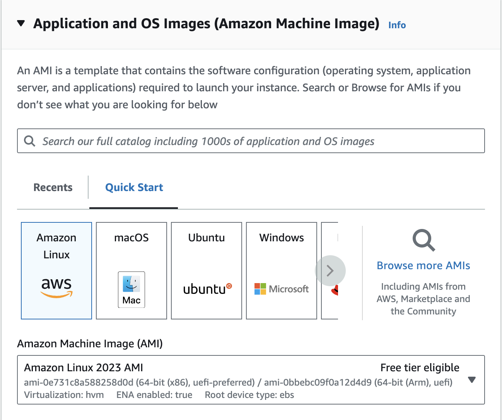
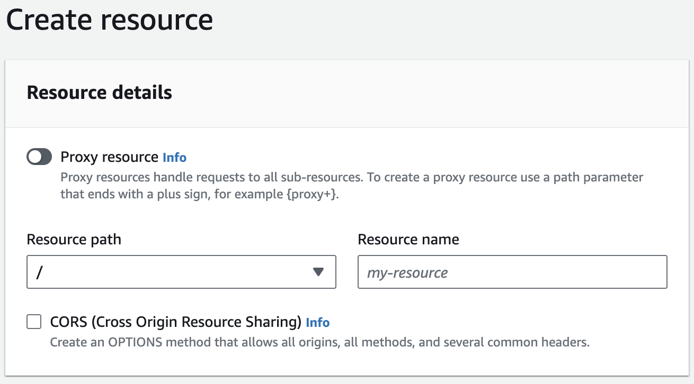

# Pinterest Data Pipeline

## Table of Contents
- [Project Description](#project-description)
- [Technologies used](#technologies-used)
- [Project Overview](#project-overview)
- [Building the Pinterest Data Pipeline](#building-the-pinterest-data-pipeline)
    - [Generate Pinterest Data](#generate-pinterest-data)
- [Batch Processing](#batch-processing)
    - [Configure the EC2 Kafka Client](#configure-the-ec2-kafka-client)
    - [Connect a MSK cluster to a S3 bucket](#connect-a-msk-cluster-to-a-s3-bucket)
    - [Configuring an API in API Gateway](#configuring-an-api-in-api-gateway)
    - [Automating Batch Processing with AWS MWAA](#automating-batch-processing-with-aws-mwaa)
- [Stream Processing](#stream-processing)
- [Next steps](#next-steps)
- [File structure of the project](#file-structure-of-the-project)
- [Licence information](#licence-information)

## Project Description
This project replicates a data pipeline similar to the one used by Pinterest for processing billions of data points daily. In this project, the data pipeline created encompasses various stages including batch processing, stream processing and data transformation and analysis using tools such as Apache Kafka Amazon S3, AWS Kinesis and Databricks. This provides hands-on experience with these technologies, emulating a real-world data engineering scenario.

## Technologies used
- [**Apache Kafka**](https://kafka.apache.org/)
> Apache Kafka is an open-source distributed event streaming platform well suited for handling high-throughput, fault-tolerant handling of data pipelines.

- [**Amazon EC2**](https://aws.amazon.com/ec2/)
> Amazon Elastic Compute Cloud offers scalable computing capacity in the cloud. It enables you to launch EC2 instances which represent virtual servers in the cloud, running on AWS infrastructure.

- [**AWS MSK**](https://aws.amazon.com/msk/)
> Amazon Managed Streaming for Apache Kafka is a fully managed service that enables you to build and run applications that use Apache Kafka to process streaming data.

- [**AWS MSK Connect**](https://docs.aws.amazon.com/msk/latest/developerguide/msk-connect.html)
> AWS MSK Connect simplifies the connecting of Apache Kafka applications to other AWS services. Makes it easy to create, manage and scale Kafka connectors.

- [**Kafka REST Proxy**](https://docs.confluent.io/platform/current/kafka-rest/index.html)
> The Kafka REST Proxy provides an interface for producing and consuming Apache Kafka messages over HTTP.

- [**AWS API Gateway**](https://aws.amazon.com/api-gateway/)
> AWS API Gateway is a fully managed service that makes it easy to create, publish, maintain, monitor and secure APIs at any scale.

- [**Apache Spark**](https://spark.apache.org/)
> Apache Spark is an open-source distributed multi-language engine for executing data engineering, data science and machine learning on single-node machines or clusters.

- [**Databricks**](https://www.databricks.com/)
> Databricks is a cloud-based platform designed for big data analytics and artificial intelligence. It is built on top of Apache Spark. It offers integrations with various data sources and simplifies the management of infrastructure to make it easier to derive insights from data.

- [**PySpark**](https://spark.apache.org/docs/latest/api/python/index.html)
> PySpark is the Python API for Apache Spark which enables you to perform real-time, large-scale data processing in a distributed environment using Python.

[**AWS MWAA**](https://aws.amazon.com/managed-workflows-for-apache-airflow/)
> Amazon Managed Workflows for Apache Airflow is a managed service that makes it easy to orchestrate complex data workflows using Apache Airflow. It handles the provisioning, setup and maintenance of Airflow environments.

[**AWS Kinesis**](https://aws.amazon.com/kinesis/)
> AWS Kinesis is a managed service for the collection, processing and analysis of real-time data across a wide array of applications.

## Project Overview
The project will entail replicating Pinterest's end-to-end Data processing pipeline, leveraging both batch and stream processing. 
A script is used to emulate user posts from the Pinterest platform, which are sent to an API. This stream of data initially utilises MSK Connect, which facilitates the use of Kafka for its storage in an S3 bucket. Airflow is leveraged to extract batch data from the S3 bucket and stream it to Kinesis. The data processing pipeline is complete with the streamed data cleaned by Spark.

## Building the Pinterest Data Pipeline

To begin building the data pipeline, you need to generate your set of data which will emulate the data produced from Pinterest users.  

### Generate Pinterest Data
Run the [`user_posting_emulation.py`](user_posting_emulation.py) file in the terminal, which should emulate a stream of data generated at Pinterest which captures data around posts made to Pinterest, user data and geolocation data.

## Batch Processing
You will first perform batch processing of the Pinterest data generated.

### Configure the EC2 Kafka Client
You will configure an Amazon EC2 instance to use as an Apache Kafka client machine.

#### EC2 instance setup
An EC2 instance is first configured to act as a client to communicate with an Apache Kafka cluster in AWS.
To start with, you will need to navigate to the AWS EC2 dashboard to launch an EC2 instance. Give the instance a name and keep the default Application and OS Images and instance types. The other options available may require consideration on usage and cost.


Under "Network & Security" you will then create a Key Pair. This will generate a private key file (`.pem`) which will grant you a secure SSH connection to locally access your EC2 instance.
To connect to the EC2 instance, follow the SSH client
Follow the instructions outlined under 'SSH client' to connect to your instance.

#### Kafka Setup
Now, create the Apache Kafka cluster, which will use EC2 as a client for communication from your local device to AWS.
Open the AWS MSK dashboard and navigate to Create Cluster. Keep the default options (for this project we used the recommended 2.8.1 Apache Kafka version).
Navigate to the security group of your cluster's Virtual Private Cloud and edit the inbound rules to ensure that your client machine can send data to the MSK cluster.

With your EC2 client machine already connected, navigate to the directory where your Private key file is located and run the following commands to install Kafka on the client machine:

```
# install Java, required for Kafka
sudo yum install java-1.8.0
# download the same version of Kafka setup in the MSK Kafka cluster
wget https://archive.apache.org/dist/kafka/2.8.1/kafka_2.12-2.8.1.tgz
tar -xzf kafka_2.12-2.8.1.tgz
```

Next, install the IAM MSK authentication package onto your client EC2 machine:

```
# navigate to the correct directory
cd kafka_2.12-2.8.1/libs/
# download the package
wget https://github.com/aws/aws-msk-iam-auth/releases/download/v1.1.5/aws-msk-iam-auth-1.1.5-all.jar
```

Configure the client to use the IAM package:

```
# open bash config file
nano ~/.bashrc
```

Add the following line to the config file, then save and exit:

```
export CLASSPATH=/home/ec2-user/kafka_2.12-2.8.1/libs/aws-msk-iam-auth-1.1.5-all.jar

# activate changes to .bashrc
source ~/.bashrc
```

Lastly, to complete the Kafka client configuration, modify the client.properties file and exit:

```
# navigate to Kafka bin folder
cd ../bin
# create client.properties file
nano client.properties

# Sets up TLS for encryption and SASL for authN.
security.protocol = SASL_SSL

# Identifies the SASL mechanism to use.
sasl.mechanism = AWS_MSK_IAM

# Binds SASL client implementation.
sasl.jaas.config = software.amazon.msk.auth.iam.IAMLoginModule required;

# Encapsulates constructing a SigV4 signature based on extracted credentials.
# The SASL client bound by "sasl.jaas.config" invokes this class.
sasl.client.callback.handler.class = software.amazon.msk.auth.iam.IAMClientCallbackHandler
```

#### Create topics on the Kafka cluster

You can now proceed to create topics on the Kafka cluster using the client machine command line to complete EC2 Kafka configuration. You can retrieve the Bootstrap servers string from AWS MSK to create your topic. More information on this in the [AWS MSK documentation](https://docs.aws.amazon.com/msk/latest/developerguide/create-topic.html)

```
<path-to-your-kafka-installation>/bin/kafka-topics.sh --create --bootstrap-server <BootstrapServerString> --command-config client.properties --topic <topic name>
```

In this project we created three topics to represent `pinterest_data`, `geolocation_data` and `user_data`.

### Connect a MSK cluster to a S3 bucket
You will need to create the S3 bucket that you will use to store the data that will pass through your Kafka cluster.
On your EC2 client command line, download the Confluent.io Amazon S3 connector:

```
# download package
sudo wget https://packages.confluent.io/archive/7.2/confluent-7.2.0.tar.gz
# unpack .tar
tar -xvzf confluent-7.2.0.tar.gz 
```

Next, change the `bootstrap.servers` and the `zookeeper.connect` variables to those found in the MSK cluster setup. Then modify the kafka-rest.properties file to enable authentication:

```
# navigate to the correct directory
cd confluent-7.2.0/etc/kafka-rest/
nano kafka-rest.properties

# Sets up TLS for encryption and SASL for authN.
client.security.protocol = SASL_SSL

# Identifies the SASL mechanism to use.
client.sasl.mechanism = AWS_MSK_IAM

# Binds SASL client implementation.
client.sasl.jaas.config = software.amazon.msk.auth.iam.IAMLoginModule required;

# Encapsulates constructing a SigV4 signature based on extracted credentials.
# The SASL client bound by "sasl.jaas.config" invokes this class.
client.sasl.client.callback.handler.class = software.amazon.msk.auth.iam.IAMClientCallbackHandler
```

Refer to the [Confluent documentation](https://docs.confluent.io/kafka-connectors/s3-sink/current/overview.html) on setting up the MSK connection to the S3 bucket.

### Configuring an API in API Gateway
To further replicate Pinterest's data pipeline, we will need our own API which will send data to the MSK cluster, which in turn will be stored in an S3 bucket, using the connector built previously.

Navigate to AWS API Gateway to build an API. Select the relevant option to build a REST API. Refer to the [API Gateway documentation](https://docs.aws.amazon.com/apigateway/latest/developerguide/how-to-create-api.html) on setup.
Within your API, you need to build a Kafka REST proxy integration method. Configure a proxy resource that allows you to attach the PublicDNS from your EC2 client as the Endpoint URL.
Deploy the API and make note of the Invoke URL.

Now you need to set up the Kafka REST Proxy on your EC2 client machine.
Install the Confluent package for the Kafka REST Proxy on your EC2 client, then modify the kafka-rest.properties file to enable the REST proxy to perform IAM authentication for the MSK cluster. Refer to the [Confluent S3 Sink Connector documentation](https://www.confluent.io/hub/confluentinc/kafka-connect-s3) for more.

Modify the [user_posting_emulation.py](user_posting_emulation.py) file to send data to your Kafka topics using your API Invoke URL and check data is sent to your cluster by running a Kafka consumer.

### Batch Processing on Databricks using Apache Spark

In order to batch process the data on Databricks, it's first necessary to mount the S3 bucket.
The file [Mount_S3_Bucket.ipynb](Mount_S3_Bucket.ipynb) contains the necessary steps to perform this which involves:
1. Importing required libraries
2. Read AWS credentials file into Spark DataFrame for authentication
3. Mount the S3 bucket containing messages from the Kafka topics

Following the mounting of the S3 bucket, the file [data_cleaning_batch_data.ipynb](data_cleaning_batch_data.ipynb) contains the code for reading the .json message from Kafka into three Spark DataFrames (one for each topic). Then data cleaning operations are performed on the Dataframes. You will also find code for querying the dataframes and particular insights about the data included to check quality of data cleaning operations.

### Automating Batch Processing with AWS MWAA
AWS MWAA was then used to automate the process of running the batch processing operation on Databricks. The file [0a1667ad2f7f_dag.py](0a1667ad2f7f_dag.py) contains a script for an Airflow DAG that will orchestrate the running of the notebook file above. In this instance, the workflow was scheduled at weekly intervals.

### Stream Processing
Three streams were created in AWS Kinesis for processing streaming data, for the data sources.
The previously created REST API was then configured in API Gateway to allow it to invoke Kinesis actions. Ensure that you have the appropriate IAM policies attached to the relevant IAM role to perform these actions.

#### API configuration with Kinesis proxy integration
Provision a new resource with the name streams.

Create a new method, with `GET` as the method type and define the following to create your method:
- Integration type - 'AWS Service'
- AWS Region - 'us-east-1'
- AWS Service - 'Kinesis'
- HTTP method - `POST`
- Action Type - 'User action name'
- Execution role - copy the ARN of your Kinesis access Role

In 'Integration Request' under 'HTTP Headers', add a new header:
- 'Name': 'Content-Type'
- 'Mapped from': 'application/x-amz-json-1.1'

Under 'Mapping Templates', add new mapping template:
- 'Content Type': 'application/json'
- 'Template body': `{}`

To enable you to create, describe and delete streams in Kinesis, three additional methods were defined.
Under the `streams` resource, a new child resource with the Resource name `{stream-name}` was created with the following methods defined: `POST`, `GET` and `DELETE`.
For these methods, the same settings were used in the `GET` method mentioned above except for:
- `GET`
    - 'Action': 'DescribeStream'
- 'Mapping Template':

```
{
    "StreamName": "$input.params('stream-name')"
}
```

- `POST`
    - 'Action': 'CreateStream'
    - 'Mapping Template':

```
{
    "ShardCount": #if($input.path('$.ShardCount') == '') 5 #else $input.path('$.ShardCount') #end,
    "StreamName": "$input.params('stream-name')"
}
```
- `DELETE`
    - 'Action': 'DeleteStream'
    - 'Mapping Template':

```
{
    "StreamName": "$input.params('stream-name')"
}
```

To add records to streams in Kinesis, two new child resources were created under the `{stream-name}` resource with the resource name `record` and `records`. A `PUT` method was created in both.
This followed the above settings except for:

record `PUT` method
    - 'Action': 'PutRecord'
    - 'Mapping Template':

```
{
    "StreamName": "$input.params('stream-name')",
    "Data": "$util.base64Encode($input.json('$.Data'))",
    "PartitionKey": "$input.path('$.PartitionKey')"
}
```

records `PUT` method
    - 'Action': 'PutRecord'
    - 'Mapping Template':

```
{
    "StreamName": "$input.params('stream-name')",
    "Records": [
       #foreach($elem in $input.path('$.records'))
          {
            "Data": "$util.base64Encode($elem.data)",
            "PartitionKey": "$elem.partition-key"
          }#if($foreach.hasNext),#end
        #end
    ]
}
```

#### Send data to the Kinesis streams
Run the script [user_posting_emulation_stream_data.py](user_posting_emulation_stream_data.py), which will initiate an infinite loop to retrieve Pinterest data records and send them via the API to Kinesis.

#### Processing the streaming data
The notebook [stream_processing.ipynb](/stream_processing.ipynb) contains all the code necessary to retrieve the streams from Kinesis, clean the data and load it into Delta Tables on Databricks. Some of the steps taken in this notebook include:
1. Importing required libraries
2. Read AWS credentials file into Spark DataFrame for authentication
3. Read Kinesis streaming data into notebook
4. Deserialize streaming data
5. Define schema to parse JSON data into DataFrame
6. Clean all three DataFrame streams
7. Write streams to Delta tables

## Next steps
To replicate the Pinterest Data Pipeline, additional steps may be necessary for business uses, such as allowing the querying of the streaming data by using the relevant data visualisation tools such as Tableau or Power BI.

## File structure of the project
The project is structured as follows:

`user_posting_emulation.py`: File emulates user posting behaviour for eventual batch processing

`user_posting_emulation_stream_data.py`: Simulates user posting behavior for streaming data

`data_cleaning_batch_data.ipynb`: Databricks notebook for batch processing

`stream_processing.ipynb`:  Databricks notebook for stream processing

`0a1667ad2f7f_dag.py` : Apache Airflow DAG file for workflow orchestration

`Mount_S3_Bucket.ipynb` : Databricks notebook for mounting S3 buckets

`README.md`: Documentation file providing information about the Pinterest Data Pipeline.


## Licence information
MIT License

Copyright (c) 2024 Spencer Duvwiama

Permission is hereby granted, free of charge, to any person obtaining a copy
of this software and associated documentation files (the "Software"), to deal
in the Software without restriction, including without limitation the rights
to use, copy, modify, merge, publish, distribute, sublicense, and/or sell
copies of the Software, and to permit persons to whom the Software is
furnished to do so, subject to the following conditions:

The above copyright notice and this permission notice shall be included in all
copies or substantial portions of the Software.

THE SOFTWARE IS PROVIDED "AS IS", WITHOUT WARRANTY OF ANY KIND, EXPRESS OR
IMPLIED, INCLUDING BUT NOT LIMITED TO THE WARRANTIES OF MERCHANTABILITY,
FITNESS FOR A PARTICULAR PURPOSE AND NONINFRINGEMENT. IN NO EVENT SHALL THE
AUTHORS OR COPYRIGHT HOLDERS BE LIABLE FOR ANY CLAIM, DAMAGES OR OTHER
LIABILITY, WHETHER IN AN ACTION OF CONTRACT, TORT OR OTHERWISE, ARISING FROM,
OUT OF OR IN CONNECTION WITH THE SOFTWARE OR THE USE OR OTHER DEALINGS IN THE
SOFTWARE.
